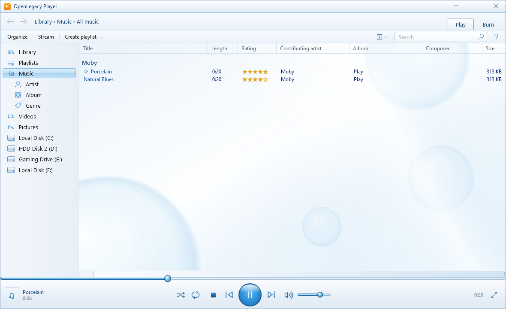
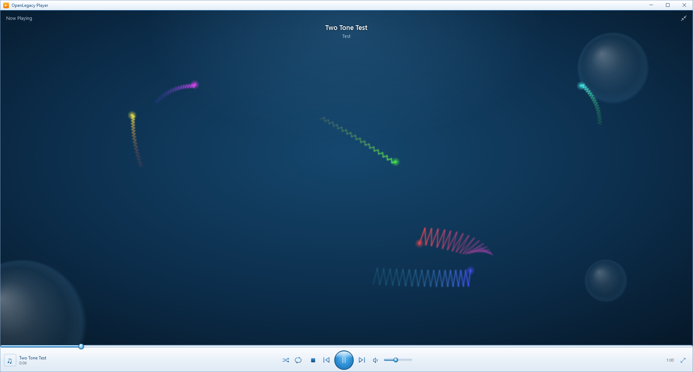
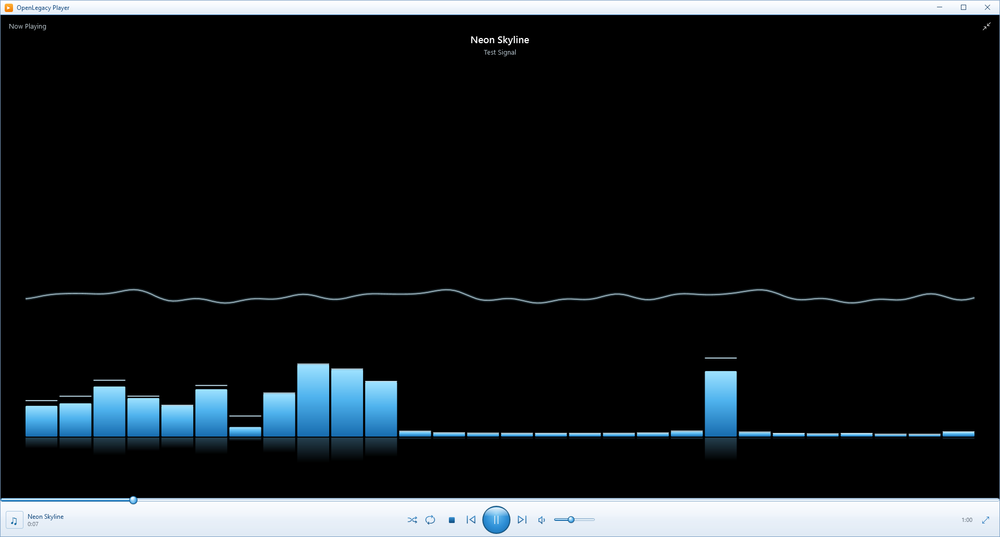
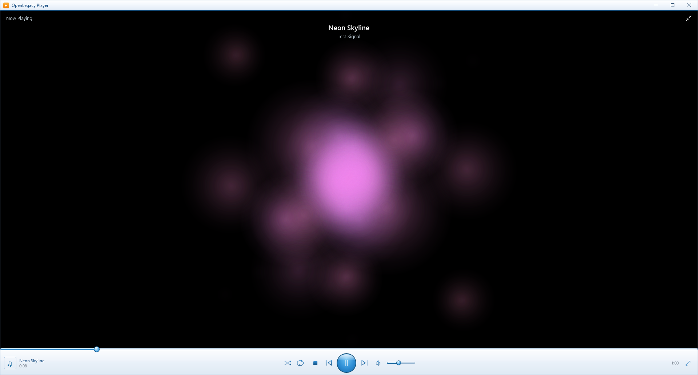
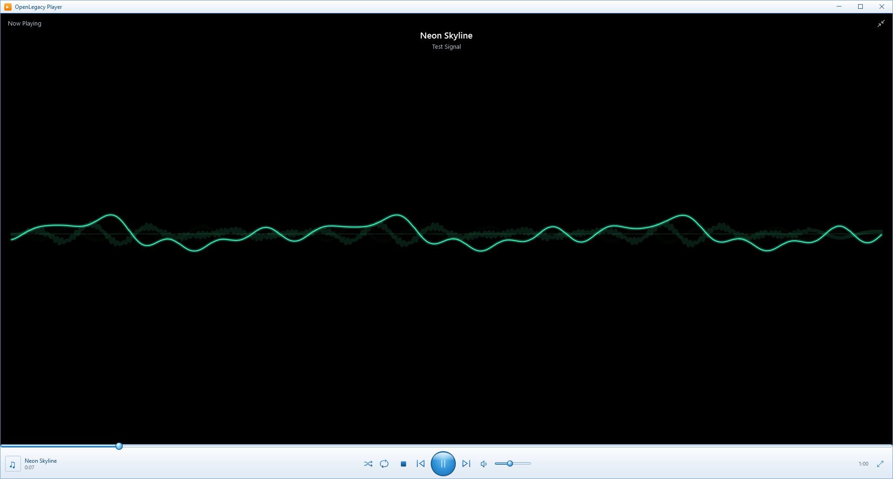

# OpenLegacy Player

**The classic Windows Media Player experience, reborn in full Frutiger Aero.**

OpenLegacy Player is a loving recreation of *Windows Media Player Legacy* — the
glossy blue orbs, the glass panels, the light streaks and floating bubbles of the
Windows Vista/7 era — rebuilt from scratch as a modern, open-source music player
for Windows 10 and 11.

  
  

  
  

---

## ⬇️ Download — v0.2.0

Grab the latest version from the
[**Releases page**](https://github.com/NokaAngel/OpenLegacyPlayer/releases):

| | |
|---|---|
| **`OpenLegacyPlayer-Setup-x.y.z.exe`** | Installer — Start menu entry, optional desktop icon, clean uninstall |
| **`OpenLegacyPlayer-Portable-x.y.z.zip`** | Portable — unzip anywhere and run, nothing to install |

Both are self-contained: **no .NET installation required.** Windows 10/11, 64-bit.

---

## ✨ What's in v0.2.0

### The Aero experience
- Full **Frutiger Aero interface**: glass window chrome, gradient toolbars, the
  glossy blue play orb, floating glass bubbles, diagonal light streaks, and
  liquid-fill sliders with glass-ball thumbs.
- A redesigned **Now Playing** view — the Album art scene sits on a deep-blue
  glass backdrop with a glow halo and mirrored reflection, while every
  visualization runs on a **pure black stage**, just like the original.
  **Right-click ▸ Visualizations** to switch:
  - **Bars and Waves** — *Bars* (a real spectrum analyzer with peak caps, water
    reflections and a live waveform ribbon), *Ocean Mist* (luminous fog waves
    rolling in the dark), and *Scope* (a glowing oscilloscope trace with
    afterglow).
  - **Alchemy ▸ Random** — jagged neon comet ribbons with lens-flare heads.
  - **Battery** — *sepiaswirl* (kaleidoscopic smoke with a breathing mandala and
    a palette that drifts around the colour wheel) and *purple haze* (slow
    violet nebula clouds).
- **Truly audio-reactive** — playback runs through an FFT tap, so every scene
  responds to the actual music: bars track the spectrum, ribbons kink with
  their band's energy, fog banks swell with theirs, and bass drives the smoke.
- **Aero glass menus** everywhere — the right-click menus and toolbar dropdowns
  are all frosted glass with the classic blue hover, and the old shortcuts work:
  `Ctrl+H` shuffle, `Ctrl+T` repeat, `Space` play/pause.
- Custom chrome that still behaves like a real window: snapping, resizing,
  maximizing to the work area (your taskbar stays visible), and a red-glow
  close button straight out of 2007.

### Your music
- **Library** — add folders or files; title, artist, album, genre, year, duration
  and cover art are read automatically from the tags.
- **Drive browsing** — your fixed and USB drives appear right in the navigation
  pane. Select one and it finds every audio file on it, live-streamed into a list
  grouped by folder — no freezing, even with tens of thousands of files.
- **Playlists** — create playlists and add tracks with a right-click. Stored as
  standard **`.m3u`** files, so they work in any other player too.
- **Internet radio** — click **Stream** on the toolbar and paste any MP3 radio
  or media stream URL. It plays instantly, and the visualizers react to it just
  like a local file.
- **Opens your files** — double-click a song and it plays in OpenLegacy Player
  (once you've set it as your default from *Settings ▸ Set as default music
  player*). A second launch hands the file to the running window instead of
  opening a new one.
- **Views** — All music, Artist, Album, Genre, Videos and Pictures, with the
  classic group headers, blue title links and gold star ratings.

### Quality of life
- Everything **persists between sessions**: your library, playlists, volume,
  shuffle/repeat, and window size all come back the way you left them.
- **Settings** dialog (*Organize ▸ Settings…*) with quick access to your data
  folders and an update-check toggle.
- Built-in **automatic updater** — the app quietly checks this repository's
  releases on startup. When one is found it shows a tidy **"Update available"
  card with the full changelog** and lets you choose **Update now** or **Ask
  later** — never forced. On the installed version, Update now **downloads the
  new installer, updates in place and restarts the app** (with live progress in
  the status bar); the portable version opens the download page. Nothing is ever
  downloaded without your OK, and the startup check can be turned off in Settings.
- Working **back / forward** navigation, live search, and a streaming scan
  progress bar in true WMP style.

---

## 🚀 Getting started

1. **Add music** — *Organize ▸ Add folder to library…*, or just click a drive in
   the left pane to browse everything on it without importing.
2. **Play** — double-click any track. Use the transport bar for shuffle, repeat,
   seek and volume.
3. **Now Playing** — click the ⤢ button at the bottom-right (or the album
   thumbnail) for the full-screen Aero scene, then **right-click** to switch
   between Album art, Bars and Waves, and Alchemy.
4. **Playlists** — *Create playlist* on the toolbar, then right-click tracks ▸
   *Add to playlist*.

Your data lives in `%AppData%\OpenLegacyPlayer` — the library index
(`library.json`), playlists (`Playlists\*.m3u`) and settings (`settings.json`).
Delete that folder and the app starts completely fresh.

---

## 📌 Good to know

- Playback uses the system's Media Foundation codecs — mp3, m4a/aac, wma, wav
  and flac all play out of the box on Windows 10/11.
- The **Burn** tab and **Stream** button are cosmetic nods to the original for
  now.
- Settings marked *(coming soon)* — color themes, mini player, crossfade,
  session resume — are planned, not yet functional.

## 🗺 Roadmap

- Color themes (Energy Blue, Emerald, Violet)
- Album / Artist tile views with cover art
- Mini / compact player mode
- Editable ratings and metadata
- More Alchemy and Battery presets
- Video playback surface in Now Playing
- Drag-and-drop playlist reordering

Found a bug or have an idea? [Open an issue](https://github.com/NokaAngel/OpenLegacyPlayer/issues)!

## 📄 License

[MIT](LICENSE). OpenLegacy Player is a fan recreation made for the love of an
era; it is not affiliated with or endorsed by Microsoft. "Windows Media Player"
is a trademark of Microsoft Corporation.

---

> *Built with a healthy dose of nostalgia for the glassy, glossy Aero years.* 💧
